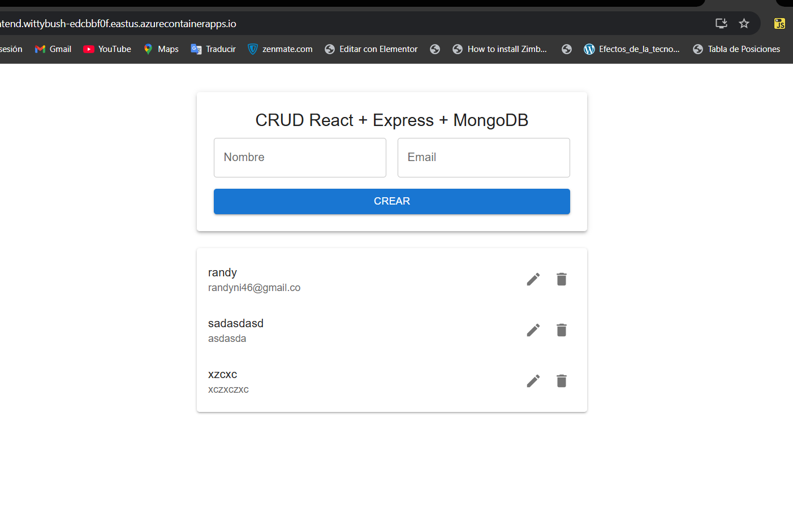

# 📘 Informe Técnico

## Despliegue de Aplicación CRUD Fullstack en Azure

---

## 1. 📌 Descripción General

Este proyecto consiste en el desarrollo y despliegue de una **aplicación CRUD fullstack**, compuesta por:

* **Frontend**: React + Material UI
* **Backend**: Node.js + Express
* **Base de datos**: MongoDB (Cosmos DB / MongoDB Atlas compatible)
* **Infraestructura**: Docker, Azure Container Registry (ACR) y Azure Container Apps

La aplicación permite **crear, listar, actualizar y eliminar usuarios**, y se encuentra completamente publicada en la nube.

---

## 2. 🧱 Arquitectura

```
[ Navegador ]
      |
      v
[ Frontend - React ]
      |
      v
[ Backend - Express API ]
      |
      v
[ MongoDB (Cosmos / Atlas) ]
```

Todos los componentes (frontend y backend) están **contenedorizados con Docker** y desplegados como **Azure Container Apps**.

---

## 3. ⚙️ Tecnologías Utilizadas

### Frontend

* React
* Vite
* Material UI
* Fetch API

### Backend

* Node.js
* Express
* Mongoose
* dotenv
* CORS

### Infraestructura & DevOps

* Docker
* Azure Container Registry (ACR)
* Azure Container Apps
* Azure CLI
* MongoDB (Cosmos DB / Atlas)

---

## 4. 📂 Estructura del Proyecto

```
crud-app/
├── backend/
│   ├── models/
│   ├── db.js
│   ├── index.js
│   ├── package.json
│   └── Dockerfile
│
├── frontend/
│   ├── src/
│   ├── App.jsx
│   ├── package.json
│   ├── vite.config.js
│   └── Dockerfile
│
└── infra/
```

---

## 5. 🔙 Backend – API REST

### Endpoints disponibles

| Método | Endpoint     | Descripción               |
| ------ | ------------ | ------------------------- |
| GET    | `/users`     | Listar usuarios           |
| POST   | `/users`     | Crear usuario             |
| PUT    | `/users/:id` | Actualizar usuario        |
| DELETE | `/users/:id` | Eliminar usuario          |
| GET    | `/health`    | Health check del servicio |

### Código principal (`index.js`)

```js
app.get("/health", (req, res) => {
  res.json({ status: "ok", db: "connected" });
});
```

---

## 6. 🎨 Frontend – React + Material UI

El frontend consume directamente el backend mediante una URL pública hardcodeada:

```js
const API = "https://<backend-url>.azurecontainerapps.io/users";
```

Características:

* UI con Material UI
* CRUD completo
* Edición en línea
* Confirmación de eliminación

---

## 7. 🐳 Dockerización

### Backend – Dockerfile

```dockerfile
FROM node:18-alpine
WORKDIR /app
COPY package*.json ./
RUN npm install
COPY . .
EXPOSE 3001
CMD ["node", "index.js"]
```

### Frontend – Dockerfile

```dockerfile
# Build
FROM node:18-alpine AS build
WORKDIR /app
COPY package*.json ./
RUN npm install
COPY . .
RUN npm run build

# Run
FROM nginx:alpine
COPY --from=build /app/dist /usr/share/nginx/html
EXPOSE 80
CMD ["nginx", "-g", "daemon off;"]
```

---

## 8. ☁️ Despliegue en Azure

### 8.1 Azure Container Registry (ACR)

Login:

```bash
az acr login --name crudacr2856
```

Push de imágenes:

```bash
docker tag crud-backend crudacr2856.azurecr.io/crud-backend:latest
docker push crudacr2856.azurecr.io/crud-backend:latest

docker tag crud-frontend crudacr2856.azurecr.io/crud-frontend:latest
docker push crudacr2856.azurecr.io/crud-frontend:latest
```

---

### 8.2 Azure Container Apps

#### Crear entorno

```bash
az containerapp env create \
  --name crud-env \
  --resource-group crud-rg \
  --location eastus
```

#### Backend

```bash
az containerapp create \
  --name crud-backend \
  --resource-group crud-rg \
  --environment crud-env \
  --image crudacr2856.azurecr.io/crud-backend:latest \
  --target-port 3001 \
  --ingress external \
  --registry-server crudacr2856.azurecr.io
```

#### Frontend

```bash
az containerapp create \
  --name crud-frontend \
  --resource-group crud-rg \
  --environment crud-env \
  --image crudacr2856.azurecr.io/crud-frontend:latest \
  --target-port 80 \
  --ingress external \
  --registry-server crudacr2856.azurecr.io
```

---

## 9. 🌍 Acceso Público

* **Backend**

  ```
  https://crud-backend.<env>.azurecontainerapps.io/health
  ```

* **Frontend**

  ```
  https://crud-frontend.wittybush-edcbbf0f.eastus.azurecontainerapps.io/
  ```

---

## 10. ✅ Estado Final

✔️ Aplicación fullstack funcional
✔️ Backend y frontend desacoplados
✔️ Infraestructura cloud
✔️ Escalabilidad automática
✔️ Acceso público vía HTTPS

---

## 11. 🔮 Mejoras Futuras

* Autenticación (JWT)
* Backend privado (solo interno)
* Variables de entorno seguras (Key Vault)
* CI/CD con GitHub Actions
* Terraform para Container Apps
* Dominio personalizado

---

## 12. 👨‍💻 Autor

**Proyecto desarrollado como ejercicio práctico de arquitectura cloud, contenedores y despliegue fullstack en Azure. Por rafch17**

---

